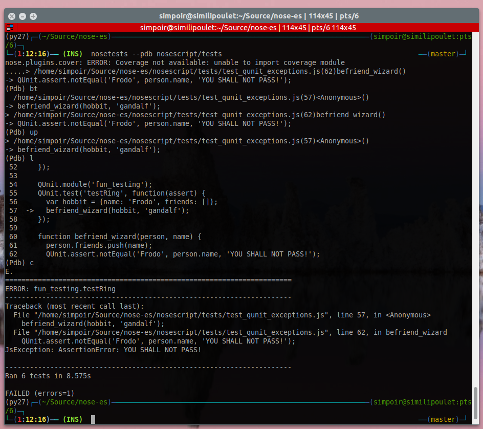

Description
===========

A module for adding some QC-related features for python projects integrating
a bit of javascript.

And it looks like

Requirements
============

* python2.7
* libnspr4-dev

Usage
=====

::

  # nose --with-jscriptunit

Will scan packages and paths and match, as nose usually does, but also match
js files that correspond matchexp (test_*.js) and load them using a thin
integration api matching QUnit API. Results will be merged with the rest
of the test results.
